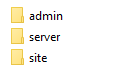

# SUPERB - Booking manager

## Backend server

This challenge has been designed to measure your knowledge of Node.js, Docker, and various
technologies, like databases and testing.

- [Objective](#objective)
- [Living project](#living-project)
- [Frontend Repositories](#frontend-repositories)
- [Technologies](#technologies)
- [System Flow](#system-flow)
- [REST API](#rest-api)
- [Tests](#tests)
- [Run and Install](#run-and-install)

## Objective

The objective is to implement a system to able users to send booking requests to a server, that verify if the booking is possible and save it. To make it possible the project is split into 3 parts: This one with the backend server and the other two with the client site and a management system for the restaurant owner to manage the tables, bookings, and working days/hours.

## Living project

- [Server API](http://ec2-44-192-120-191.compute-1.amazonaws.com:3000)
- [Client Booking Site](http://ec2-44-192-120-191.compute-1.amazonaws.com/)
- [Restaurant owner system](http://ec2-44-192-120-191.compute-1.amazonaws.com:8080/)

## Frontend repositories

- [Client Booking Site](https://github.com/leandrocoder/superb-exercise-site)
- [Restaurant owner system](https://github.com/leandrocoder/superb-exercise-admin)

## Technologies

For the backend server the frameworks used are: [Koa](https://www.npmjs.com/package/koa), [MongoDB](https://www.mongodb.com/) and [AWS](https://aws.amazon.com/) SQS for the queue system and docker hosting.

## System Flow

The basic system flow sends booking requests to a queue service, this could be useful in case of a huge amount of simultaneous requests, ensuring the server just receives a number of messages that can handle.


## REST API

### Get Settings

**Request**

```GET /settings```

**Response**
```
{
    "openTime": "11:00",
    "closeTime": "23:00",
    "openDays": [
        true,
        true,
        true,
        true,
        false,
        false,
        false
    ]
}
```

### Update Settings

**Request**

```PUT /settings```
```
{
    "openTime": "11:00",
    "closeTime": "23:00",
    "openDays": [
        true,
        true,
        true,
        true,
        false,
        false,
        false
    ]
}
```

**Response**
```
{
    "openTime": "11:00",
    "closeTime": "23:00",
    "openDays": [
        true,
        true,
        true,
        true,
        false,
        false,
        false
    ]
}
```

### List Bookings

**Request**

```GET /booking```

**Response**
```
[
    {
        "name": "User name",
        "phone": "+ 1 555 5555",
        "date": "2022-02-15"
        "hour": "13:00",
        "chairs": 4,
        "table": "table ObjectId",
        "id": "ObjectId"
    }
    ...
]
```

### Create a Booking

**Request**

```POST /booking```
```
{ 
    "name": "User name",
    "phone": "+ 1 555 5555",
    "date": "2022-02-15"
    "hour": "13:00",
    "chairs": 4,
    "table": "table ObjectId",
    "id": "ObjectId"
}
```

**Response**

``` { "status": true, "id": {{ObjectId}} } ```

### Delete a Booking

**Request**

```DELETE /booking/{{BOOKING ID}}```


**Response**

``` { "status": true } ```

### Queue booking request

**Request**

```POST /queue```
```
{ 
    "name": "User name",
    "phone": "+ 1 555 5555",
    "date": "2022-02-15"
    "hour": "13:00",
    "chairs": 4,
    "table": "table ObjectId",
    "id": "ObjectId"
}
```

**Response**

``` { "status": true } ```

### Hour Status

Passing a date, the system return all available hours considering if the restaurant is open in the date. The property "tables" indicate the number of available tables.

**Request**

```GET /hours```

**Response**
```
[
    { "tables": 2, "time": "09:00" },
    { "tables": 1, "time": "10:00" },
    { "tables": 0, "time": "13:00" },
    ...
]
```

### List Tables

**Request**

```GET /table```

**Response**

```
[
    {
        "chairs": 4,
        "id": "61805359b47cc91ad8e1a1a3"
    }
    ...
]
```

### Create a Table

**Request**

```POST /table```

**Response**
```
{
    "chairs": 4,
    "id": "618064913316472790414d52"
}
```

### Delete a Table

**Request**

```DELETE /table/{{BOOKING ID}}```


**Response**

``` { "status": true } ```

### Drop a database Table

Just for make tests easier.

**Request**

```DELETE /drop/{{TABLE NAME}}```


**Response**

``` { "status": true } ```


## Tests

The test running tool used to ensure all the endpoints in this project are running well is [Jest](https://jestjs.io/).
To run the tests use the command ```npm test```

- Database
    - [x] Connect

- API
    - [x] Successful request the base route

- Booking
    - [x] Create a restaurant table
    - [x] Fail passing a invalid date
    - [x] Fail passing a date before today
    - [x] Fail passing a invalid hour
    - [x] Fail passing a hour out of range
    - [x] Success requesting a booking with all correct data
    - [x] Delete booking
    - [x] Delete a table

## Run and Install

To run the project, just install the dependencies using ```npm i``` and ```npm start```

The project is full dockerized, to run it in a docker use the commands:

```
docker build -t exercise-server .
docker run -d -p 3000:3000 exercise-server
```

Or just running the ```docker-compose.yml``` that will run all the tree projects (server, admin and site) with the command:
```
docker-compose up
```

### AWS Deploy

The next commands consider the follow paths structure for the project repositories:



```
@FOR /f "tokens=*" %i IN ('docker-machine env superbtest1') DO @%i
```

```
cd ../admin
call npm i 
call npm run build
cd ../site
call npm i
call npm run build
cd ../server
docker-compose build
docker-compose up -d
```

