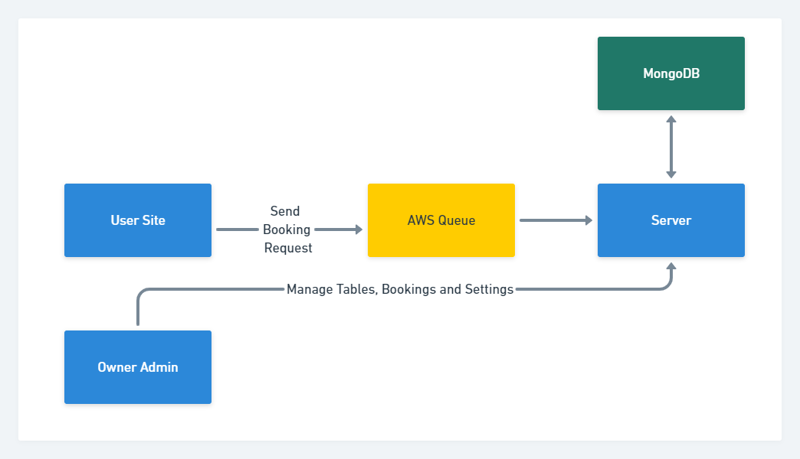

# SUPERB - Booking manager

## Backend server

This challenge has been designed to measure your knowledge of Node.js, Docker, and various
technologies, like databases and testing.

- [Objective](#)
- [Living project](#)
- [Frontend Repositories](#)
- [Technologies](#)
- [System Flow](#)
- [REST API](#)
- [Tests](#)
- [Install](#)

## Objective

The objective is to implement a system to able users to send booking requests to a server, that verify if the booking is possible and save it. To make it possible the project is split into 3 parts: This one with the backend server and the other two with the client site and a management system for the restaurant owner to manage the tables, bookings, and working days/hours.


## Frontend repositories

- [Client Booking Site](https://github.com/leandrocoder/superb-exercise-site)
- [Restaurant owner system](https://github.com/leandrocoder/superb-exercise-admin)

## Technologies

For the backend server the frameworks used are: [Koa](https://www.npmjs.com/package/koa), [MongoDB](https://www.mongodb.com/) and [AWS](https://aws.amazon.com/) for the queue system and docker hosting.

## System Flow

The basic system flow sends booking requests to a queue service, this could be useful in case of a huge amount of simultaneous requests, ensuring the server just receives a number of messages that can handle.



## REST API

### List Bookings

**Request**

```GET /booking```

**Response**
```
[
    {
        "name": "User name",
        "phone": "+ 1 555 5555",
        "date": "2022-02-15"
        "hour": "13:00",
        "chairs": 4,
        "table": "table ObjectId",
        "id": "ObjectId"
    }
    ...
]
```

### Create a Booking

**Request**

```POST /booking```
```
{ 
    "name": "User name",
    "phone": "+ 1 555 5555",
    "date": "2022-02-15"
    "hour": "13:00",
    "chairs": 4,
    "table": "table ObjectId",
    "id": "ObjectId"
}
```

**Response**

``` { "status": true } ```

### Delete a Booking

**Request**

```DELETE /booking/{{BOOKING ID}}```


**Response**

``` { "status": true } ```

### Queue booking request

**Request**

```POST /queue/```
```
{ 
    "name": "User name",
    "phone": "+ 1 555 5555",
    "date": "2022-02-15"
    "hour": "13:00",
    "chairs": 4,
    "table": "table ObjectId",
    "id": "ObjectId"
}
```

**Response**

``` { "status": true } ```

### Hour Status

Passing a date, the system return all available hours

**Request**

```GET /hours```

**Response**
```
[
    { "tables": 2, "time": "09:00" },
    { "tables": 1, "time": "10:00" },
    { "tables": 1, "time": "13:00" },
    ...
]
```

## Tests

The test running tool used to ensure all the endpoints in this project are running well is [Jest](https://jestjs.io/).

- Database
    - [x] Connect

- API
    - [x] Successful request the base route

- Booking
    - [x] Create a restaurant table
    - [x] Fail passing a invalid date
    - [x] Fail passing a date before today
    - [x] Fail passing a invalid hour
    - [x] Fail passing a hour out of range
    - [x] Success requesting a booking with all correct data
    - [x] Delete booking
    - [x] Delete a table

